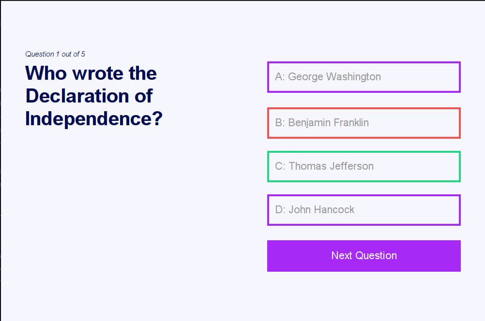

# Online Quiz Application

An interactive and user-friendly Java-based quiz application that allows users to test their knowledge in multiple categories, including General Knowledge, Science, History, and Sports. Built with a focus on modularity and security, this project features a comprehensive user authentication system, quiz management for admins, and a clean interface.


## Table of Contents
- [Features](#features)
- [Screenshots](#screenshots)
- [Technologies Used](#technologies-used)
- [Installation and Setup](#installation-and-setup)
- [Usage](#usage)
- [Contributing](#contributing)
- [License](#license)

## Features

- **User Authentication**: Secure login and registration with hashed and salted passwords.
- **Quiz Categories**: General Knowledge, Science, History, and Sports.
- **Admin Panel**: Allows admins to create, update, and delete quizzes.
- **Progress Tracking**: Users can view scores and track progress.
- **Intuitive User Interface**: Built using JavaFX or Swing for an enhanced user experience.
- **Data Persistence**: Database integration ensures quiz data and user scores are saved.
  
## Screenshots

Below are some screenshots of the application in action:

### Login Screen


### Admin Page


### Quiz Selection


### Quiz Interface


### Result Display


## Technologies Used

- **Java** (JDK 21)
- **JavaFX** or **Swing** (for GUI)
- **MYSQL Database** (for data storage and persistence)
- **Maven** (for dependencies management)

## Installation and Setup

- 1.**Clone the repository**
   ```bash
   https://github.com/GlenFonceca/QuizApplication.git
- 2.**Open in your IDE**: Import the project in your favorite Java IDE.
- 3.**Install Dependencies**: Ensure JavaFX and other dependencies are properly configured in the project. 
- 4.**Setup Database**:Create a new database with the necessary tables. (Refer to the Database Schema).
Update the database connection details in the application configuration files if needed.
- 5.**Run the Application**:Start the application by running the main class

## Usage

### For Users:
1. **Sign Up** for a new account or **Log In** if you already have one.
2. Choose a **Quiz Category** (General Knowledge, Science, History, or Sports) to start the quiz.
3. **Answer Questions** and submit to see your score.
4. **Check Previous Attempts** in see history page. 

### For Admins:
1. **Log In** as an admin to access the quiz management panel.
2. **Create**, **Update**, or **Delete** quizzes through the admin interface.


## Contributing
- **Contributions are welcome! Please open an issue to discuss what you would like to contribute or improve.**

## License
- This project is licensed under the MIT License. See the LICENSE file for more information.
